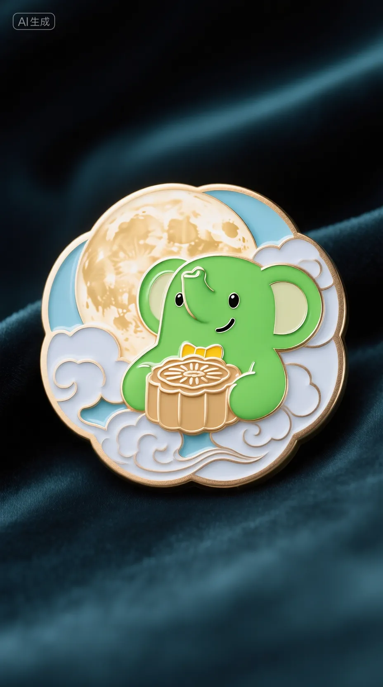
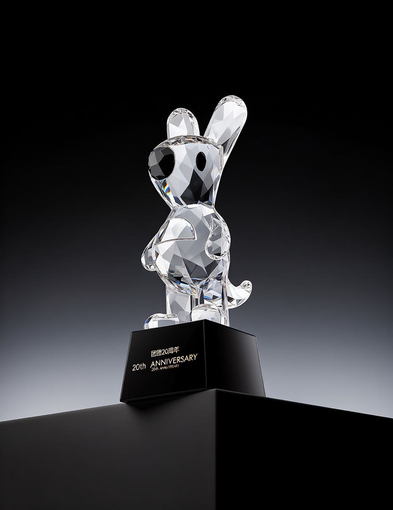
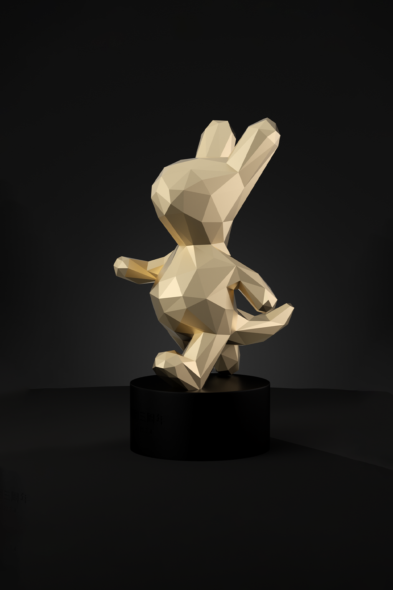
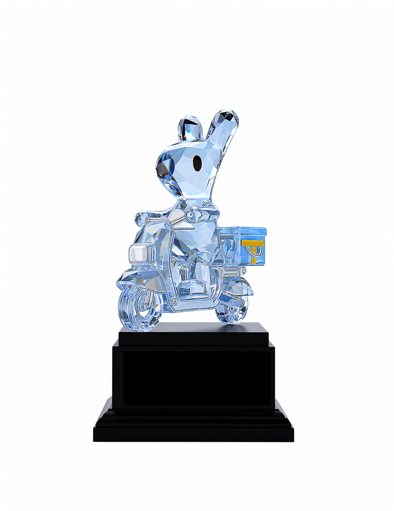
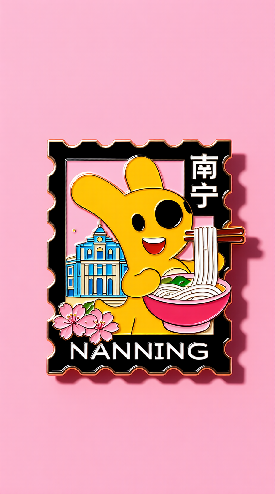

# Badge & Trophy Design — Evaluation Task Set

[English](#english) | [中文](#中文)

---

## English

> **Note**: This document is the generic cross-product evaluation version. Brand-specific content has been replaced with the fictional brand 'StarSelect / 星选'. Reference images for edit-type tasks are available in `../reference-images/` and can be used directly for evaluation.

| ID | Task Type | Prompt | Reference Image |
| :--- | :--- | :--- | :--- |
| BA-001 | Ambiguous[^1] | Design a badge featuring the brand mascot with brand elements incorporated; overall style is open | / |
| BA-002 | Ambiguous[^1] | Design a trophy combining a cartoon IP character, emphasizing creative expression and visual impact | / |
| BA-003 | Ambiguous[^1] | Design a simple, modern cartoon animal IP badge suitable for young consumer groups | / |
| BA-004 | Ambiguous[^1] | Design a badge combining Mid-Autumn Festival elements with a brand IP, reflecting a visual style that blends tradition with modernity | / |
| BA-005 | Ambiguous[^1] | Design a trophy centered on the brand IP character with a unique shape that matches the brand's character and sense of fashion | / |
| BA-006 | Explicit[^2] | Design a badge including the brand mascot 'Mengxing' element; overall style is modern and clean | / |
| BA-007 | Explicit[^2] | Design a trophy incorporating a cartoon IP character, with a clean and modern appearance suitable for award ceremonies | / |
| BA-008 | Explicit[^2] | Design a badge combining traditional cultural elements with a brand IP, expressing the modern interpretation of brand culture | / |
| BA-009 | Explicit[^2] | Design a clean vector-style trophy with brand IP elements incorporated, suitable for brand event scenarios | / |
| BA-010 | Explicit[^2] | Design a series of badges, each representing a different cartoon IP character or different character form (at least 3 designs) | / |
| BA-011 | Edit-type[^3] | Adjust the IP element in the badge: remove the prop from the mascot's hand, change the pose to waving |  |
| BA-012 | Edit-type[^3] | Change the trophy material from crystal faceted to rose gold faceted, making it more modern and creative |  |
| BA-013 | Edit-type[^3] | Change the trophy material to a platinum theme; make the base matte black obsidian, better matching the brand color system while conveying premium feel and uniqueness |  |
| BA-014 | Edit-type[^3] | Refine the trophy facet details, increase resolution, add a black background, and design it as a trophy hero visual for product promotion to make the overall visual more appealing |  |
| BA-015 | Edit-type[^3] | Modify the IP character prop in the badge: change the item in the hand to holding flowers, and add more creative elements |  |
| BA-016 | Compound[^4] | Design a brand event themed badge with the brand mascot 'Mengxing' as the main visual. The badge is a round metal badge; the center shows Mengxing standing facing forward and waving with a happy expression, wearing an event-themed lanyard or badge. Background shows brand event venue including stage lighting, event flags, balloon decorations, and brand primary color visual atmosphere. The design should highlight the 'brand event limited badge' feel, with a complete composition, high recognizability, and suitable for physical badge production | / |
| BA-017 | Compound[^4] | Design an event check-in commemorative badge featuring a cartoon animal IP. The badge uses a shield shape; the IP character stands in the center holding a welcome sign with a friendly and approachable expression. Background incorporates brand event check-in scene elements including a selfie wall, event installations, streamers, and an event title area. Overall style is clean and bright, with brand commemorative and collectible appeal | / |
| BA-018 | Compound[^4] | Design a brand honor trophy integrating the brand mascot with the brand logo. The trophy main body is a modern clean vertical structure topped with a 3D mascot figure; the lower base incorporates the brand symbol and primary brand color. Overall materials are primarily metal and transparent acrylic; the trophy shape is modern and refined, suitable for brand event award ceremonies, emphasizing premium feel, recognizability, and physical producibility | / |
| BA-019 | Compound[^4] | Design a 'Brand Star' themed trophy; the trophy top features a 3D mascot figure with a confident and cute expression. The main body is a vertical streamlined structure incorporating the brand logo outline, brand auxiliary graphics, and a metal-textured base. The overall design should be clean and modern, suitable for internal brand recognition and event award ceremonies | / |
| BA-020 | Compound[^4] | Design a crossover trophy integrating two brand cartoon IP characters. The overall trophy uses a dual-character composition; two IP characters stand together on the main body with an obvious interactive relationship (e.g., side by side, high-fiving, or jointly holding up a brand symbol). The overall trophy structure is modern and clean; the base incorporates brand elements and the crossover theme, emphasizing cross-IP collaboration feel, commemorative value, and collectibility | / |

[^1]: **Ambiguous task**: the prompt is imprecise and vague, testing the model's ability to understand and creatively interpret design requirements
[^2]: **Explicit task**: the prompt is precise, including specific brand name, style, color scheme, and composition requirements; tests the model's precise execution ability
[^3]: **Edit-type task**: based on editing an existing image; tests the model's image understanding and local editing ability
[^4]: **Compound task**: requires completing a primary design task plus scene extension or multiple proposals in one conversation; tests comprehensive ability

---

## 中文

# 徽章&奖杯设计场景评测任务集（通用竞品版）

> **说明**：本文档为通用竞品评测版本，已移除品牌特异性内容。品牌 IP 使用虚构品牌"星选"（吉祥物"萌星"），通用卡通 IP 角色描述已去除美团专属信息。编辑型需求任务所需参考图已内置于 `images/` 目录，可直接执行评测，无需手动准备图片。

| 序号 | 题目类型 | 任务提示词 | 需要上传的图片 |
| :--- | :--- | :--- | :--- |
| BA-001 | 模糊任务[^1] | 设计一个具有品牌吉祥物的徽章，画面可融入品牌元素，整体风格自由发挥 | |
| BA-002 | 模糊任务[^1] | 设计一个结合卡通 IP 形象的奖杯，突出创意表现与视觉冲击力 | |
| BA-003 | 模糊任务[^1] | 设计一个简洁且富有现代感的卡通动物 IP 徽章，适合年轻消费群体 | |
| BA-004 | 模糊任务[^1] | 设计一个融合中秋节元素与品牌 IP 的徽章，体现传统与现代结合的视觉风格 | |
| BA-005 | 模糊任务[^1] | 设计一个以品牌 IP 形象为核心的奖杯，造型独特，符合品牌气质与时尚感 | |
| BA-006 | 明确任务[^2] | 设计一款徽章，需包含品牌吉祥物"萌星"元素，整体风格现代简洁 | |
| BA-007 | 明确任务[^2] | 设计一款奖杯，融入卡通 IP 形象，外观简洁现代，适合颁奖典礼使用 | |
| BA-008 | 明确任务[^2] | 设计一款徽章，将传统文化元素与品牌 IP 结合，体现品牌文化的现代化表达 | |
| BA-009 | 明确任务[^2] | 设计一个简洁的矢量风格奖杯，并融入品牌 IP 元素，适用于品牌活动场景 | |
| BA-010 | 明确任务[^2] | 设计一组系列徽章，每枚徽章代表不同的卡通 IP 角色形象或不同角色形态（至少3款） | |
| BA-011 | 编辑型需求[^3] | 调整徽章中的 IP 元素，去掉吉祥物手中的道具，动作变成挥手 |  |
| BA-012 | 编辑型需求[^3] | 修改奖杯材质，水晶切面材质改为玫瑰金切面材质，使整体更现代、更具创意 |  |
| BA-013 | 编辑型需求[^3] | 调整奖杯材质为铂金主题，底座变成磨砂黑曜石材质，使其更符合品牌色体系，并体现高级感与独特性 |  |
| BA-014 | 编辑型需求[^3] | 优化奖杯切面细节，扩大分辨率，增加黑色背景，设计成产品宣传的奖杯主视觉，使整体视觉更具吸引力 |  |
| BA-015 | 编辑型需求[^3] | 修改徽章图案中的 IP 形象道具，将手中的物品更换为手捧鲜花，补充更有创意的元素 |  |
| BA-016 | 复合型需求[^4] | 设计一款品牌活动主题徽章，主视觉为品牌吉祥物"萌星"。徽章整体为圆形金属徽章结构，画面中心是萌星正面站立挥手，表情开心，佩戴活动主题挂绳或活动徽章。背景为品牌活动现场，包含舞台灯光、活动旗帜、气球装饰和品牌主色视觉氛围。整体设计要突出"品牌活动限定徽章"的感觉，画面完整、识别度高、适合实体徽章制作 | |
| BA-017 | 复合型需求[^4] | 设计一款活动签到纪念徽章，主角为卡通动物 IP。徽章采用盾形结构，IP 角色站在画面中心，手举活动欢迎牌，整体表情友好、亲切。背景结合品牌活动签到场景，包含打卡墙、活动装置、彩带和活动标题区。整体风格简洁明快，具有品牌纪念感和收藏属性 | |
| BA-018 | 复合型需求[^4] | 设计一款品牌荣誉奖杯，将品牌吉祥物形象与品牌标志融合。奖杯主体为现代简洁立式结构，顶部为吉祥物立体形象，下方基座融入品牌符号与品牌主色。整体材质以金属和透明亚克力为主，奖杯外形现代、精致，适合品牌活动颁奖场景，强调高级感、辨识度和可落地制作感 | |
| BA-019 | 复合型需求[^4] | 设计一款"品牌之星"主题奖杯，奖杯顶部为品牌吉祥物立体形象，吉祥物表情自信可爱。奖杯主体为竖向流线型结构，结合品牌 logo 轮廓、品牌辅助图形和金属质感基座。整体设计要求简洁现代，适合品牌内部表彰和活动颁奖使用 | |
| BA-020 | 复合型需求[^4] | 设计一款联动奖杯，融合两个品牌卡通 IP 形象。奖杯整体采用双角色联动构图，两个 IP 角色共同站在奖杯主体上，有明显互动关系（如并肩站立、击掌庆祝或共同举起品牌标识）。整体奖杯结构现代简洁，基座融入品牌元素和联名主题，强调跨 IP 合作感、纪念感和收藏感 | |

[^1]: **模糊任务**：用户的任务请求相对模糊，需要考验模型工具的理解能力
[^2]: **明确任务**：用户的任务请求非常具体，对于画面各部分都有明确的要求
[^3]: **编辑型需求**：图文指令编辑类型的需求
[^4]: **复合型需求**：在一个需求中隐含多个任务请求
