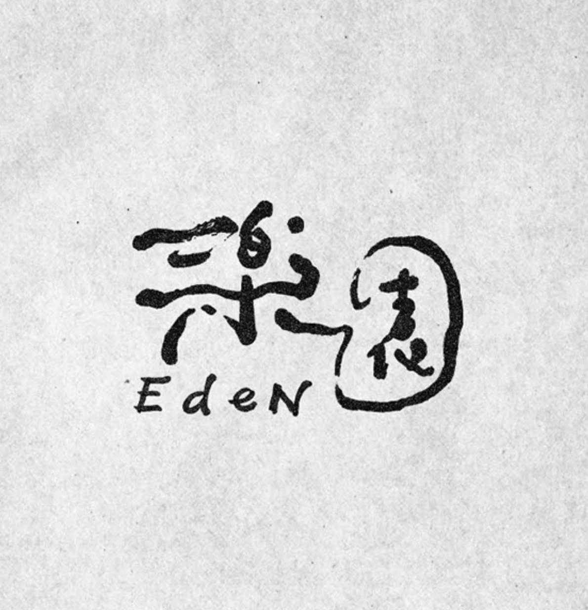
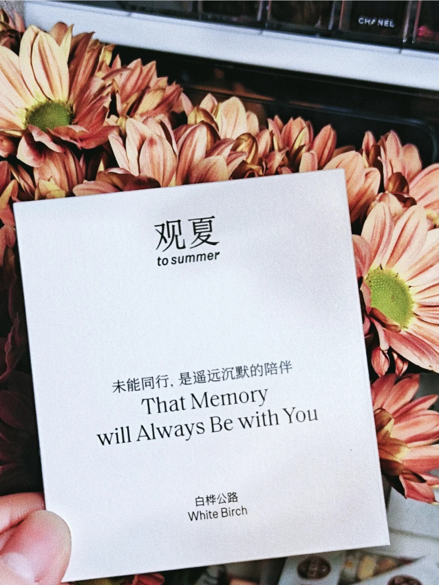
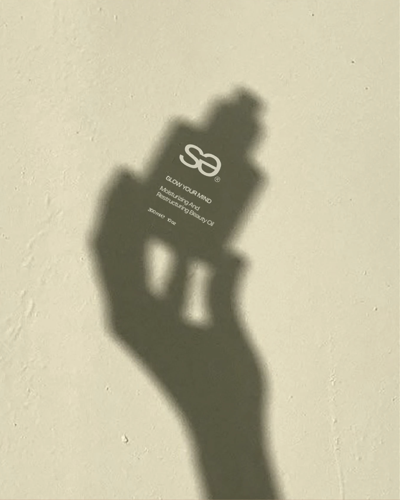
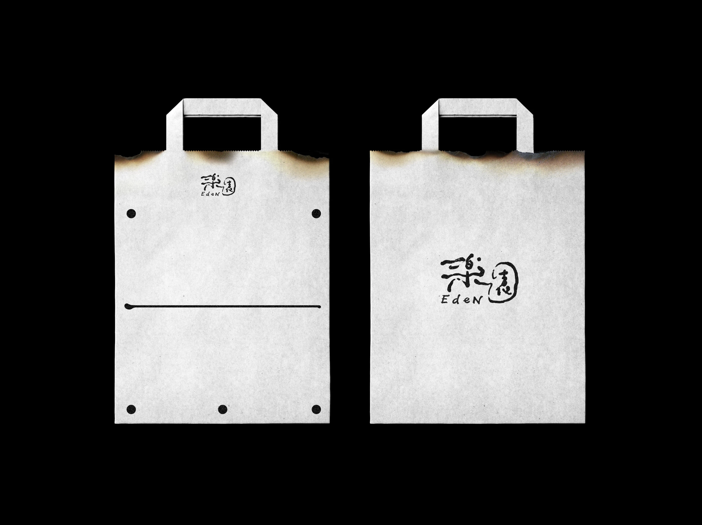
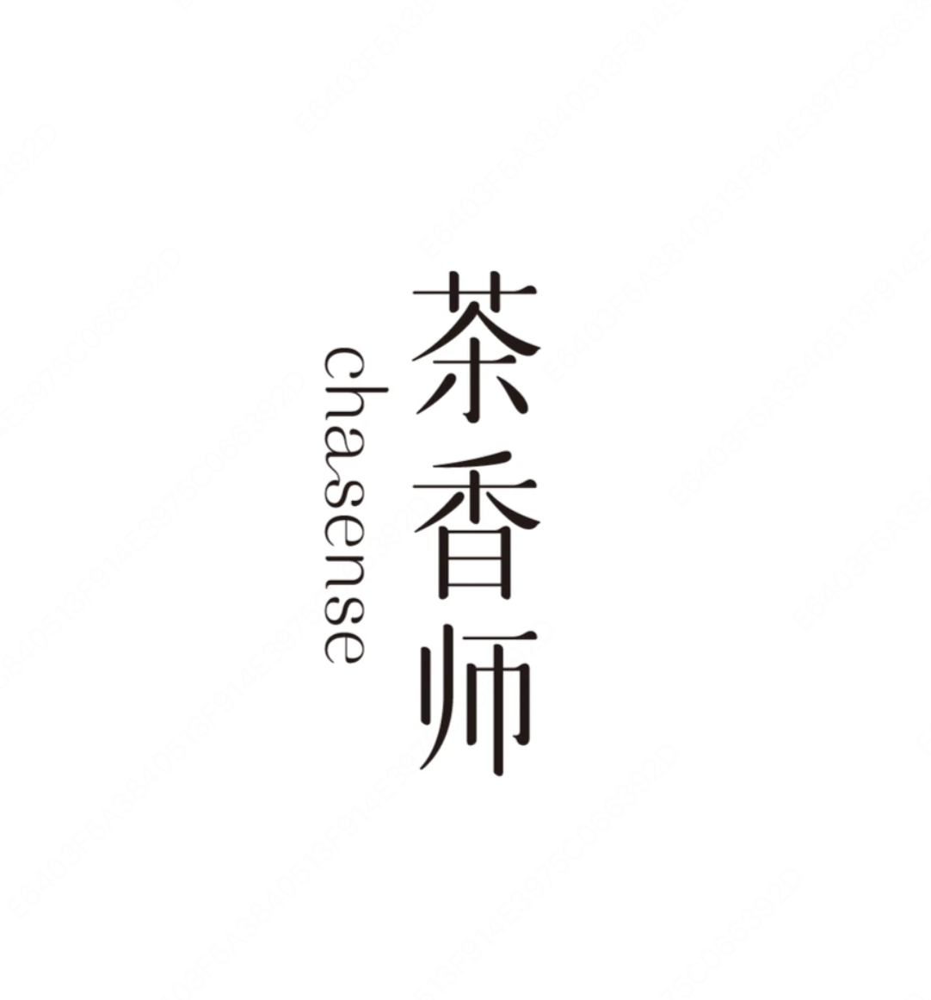
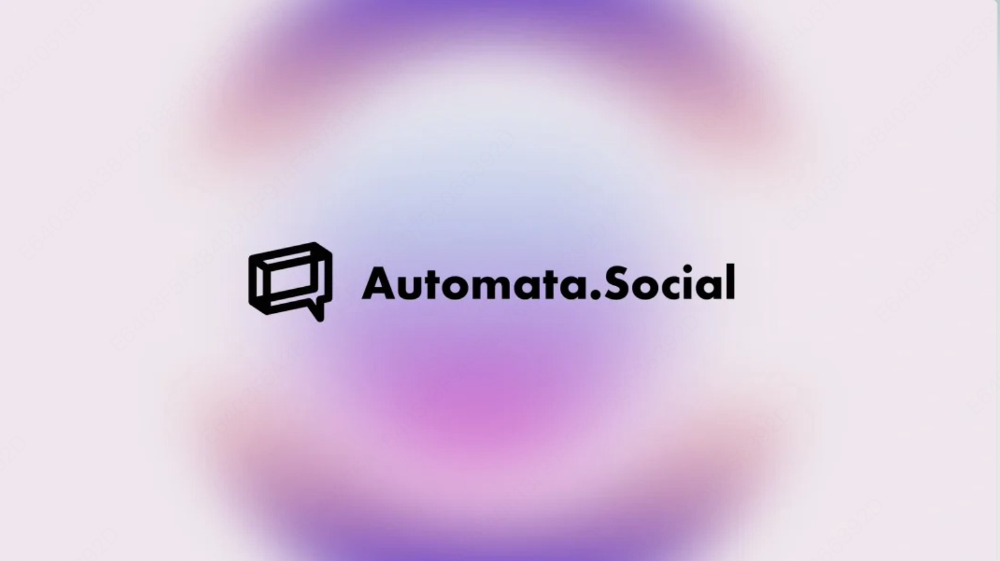
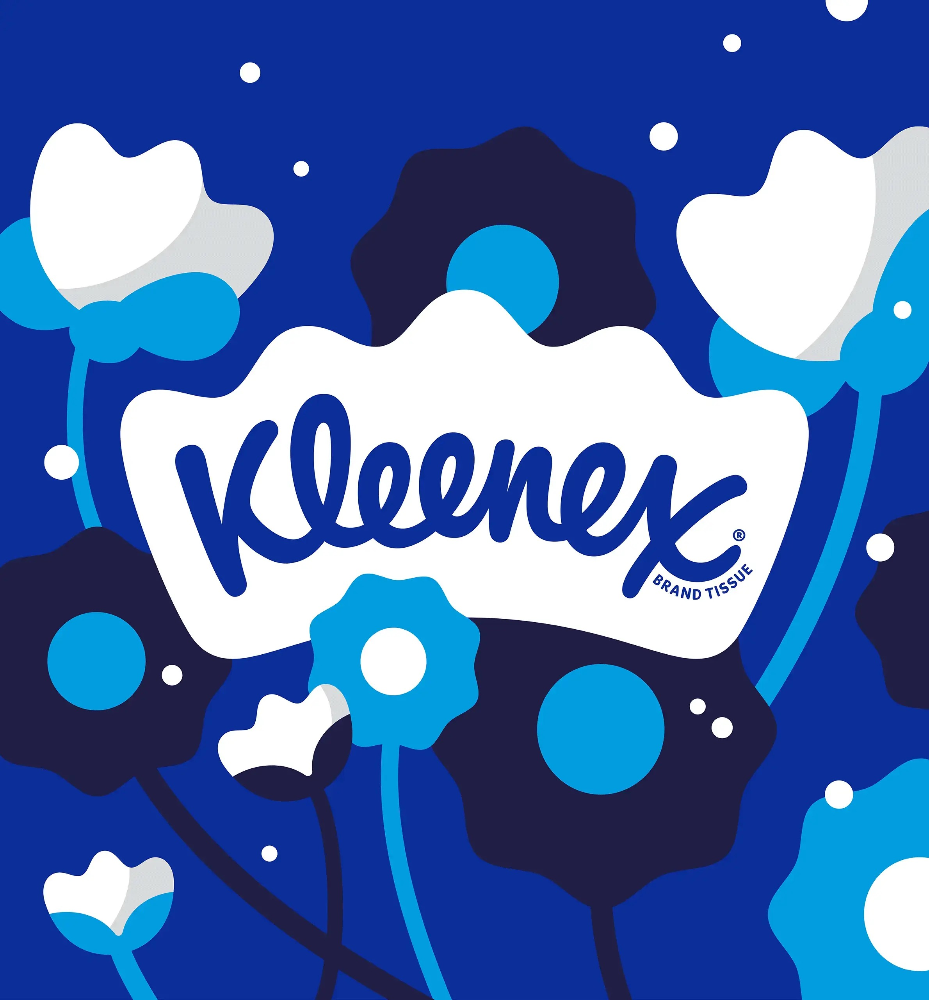

# Logo Design — Evaluation Task Set

[English](#english) | [中文](#中文)

---

## English

> **Note**: This document is the generic cross-product evaluation version. Brand-specific content has been replaced with the fictional brand 'StarSelect / 星选'. Reference images for edit-type tasks are available in `../reference-images/` and can be used directly for evaluation.

| ID | Task Type | Prompt | Reference Image |
| :--- | :--- | :--- | :--- |
| L-001 | Ambiguous[^1] | Generate a classic, high-end tea house brand logo | / |
| L-002 | Ambiguous[^1] | Design a sporty graphic logo for the apparel industry | / |
| L-003 | Ambiguous[^1] | A beauty brand logo design with high-end luxurious feel and elegant feminine typography | / |
| L-004 | Ambiguous[^1] | Generate a car brand logo — a minimal abstract symbolic graphic mark | / |
| L-005 | Ambiguous[^1] | Using this logo as reference, create an atmospheric new-Chinese-style restaurant brand logo; the name is your choice |  |
| L-006 | Explicit[^2] | Generate a tea house brand logo; brand name is '美好时光' (Beautiful Moments), pure Chinese character lettering, handwritten style, classic and high-end feel, pure black text on light green background | / |
| L-007 | Explicit[^2] | Generate an apparel brand logo; brand name is 'NEXUS', English font lettering, clean font, strongly sporty feel, premium design, solid text color on mocha brown background | / |
| L-008 | Explicit[^2] | Generate a beauty brand logo; Chinese brand name '云禾' in serif Song-style font, simple curved design, feminine and luxurious aesthetic, with serif English 'YUNHE' below; stylize the first character '云' (cloud) as a graphic mark placed to the left, premium design, solid text color, black background | / |
| L-009 | Explicit[^2] | Generate a car brand logo — a minimal abstract symbolic graphic mark using geometric shapes combined with an oval, dynamic feel, ultra-minimal, premium design, solid colors | / |
| L-010 | Explicit[^2] | Design a complete logo set for the 'Qingchen Coffee' brand with three outputs: ① full-color version (main color: warm brown); ② black-and-white version (for light-background printing); ③ mini icon version (graphics only, must remain recognizable at 32×32px) | / |
| L-011 | Edit-type[^3] | Replace the logo and text from image 1 onto the poster in image 2, maintaining visual harmony and color tone |   |
| L-012 | Edit-type[^3] | Keep all logo content on the paper bag unchanged, change the carrier to an 'apron' while maintaining the scorched-edge design style |  |
| L-013 | Edit-type[^3] | Match the logo in image 1 with a scene that fits the visual tone of image 2 |   |
| L-014 | Edit-type[^3] | Change the logo name to 'Qingshan Coffee'; keep the text style unchanged, replace the background with a blue color scheme |  |
| L-015 | Edit-type[^3] | Change the brand name in the image to '人间烟火' (Earthly Fireworks), keeping the text style unchanged |  |
| L-016 | Compound[^4] | Design a car brand logo using a minimal abstract symbolic graphic, then place it on a supercar to show the effect in a premium visual | / |
| L-017 | Compound[^4] | Design a hotel/bed-and-breakfast brand logo with simple graphic design and a warm, storytelling feel; extend a full VI suite in matching style and tone | / |
| L-018 | Compound[^4] | Design a tea house brand logo; brand name is '绿野鲜食' (Green Field Fresh Food) in pure Chinese characters, handwritten font, classic feel, pure black text on light green background; place it on a modern minimal premium white shop sign, new-Chinese-style store, premium architectural design, cool tranquil visual atmosphere | / |
| L-019 | Compound[^4] | Generate an internet tech industry logo — a positive-negative figure (mountains, sea, nature, cycle theme), creative graphic design, minimal, no text, storytelling, meaningful, premium design, blue-toned background; also design this logo on a 16:9 large screen for an internet annual ecology conference main venue. Produce three proposals | / |
| L-020 | Compound[^4] | Design a minimal coffee brand logo (brand name 'Qingshan'), then place this logo on: ① a paper coffee cup packaging mockup; ② a canvas eco-bag mockup; ③ a store signage mockup — produce a complete showcase image | / |

[^1]: **Ambiguous task**: the prompt is imprecise and vague, testing the model's ability to understand and creatively interpret design requirements
[^2]: **Explicit task**: the prompt is precise, including specific brand name, style, color scheme, and composition requirements; tests the model's precise execution ability
[^3]: **Edit-type task**: based on editing an existing image; tests the model's image understanding and local editing ability
[^4]: **Compound task**: requires completing a primary design task plus scene extension or multiple proposals in one conversation; tests comprehensive ability

---

## 中文

# Logo 设计场景评测任务集（通用竞品版）

> **说明**：本文档为通用竞品评测版本，已移除品牌特异性内容，适用于对各 AI 设计工具的横向评测。编辑型需求任务所需参考图已准备好（存放于 `images/` 目录），可直接执行评测。

| 序号 | 题目类型 | 任务提示词 | 需要上传的图片 |
| :--- | :--- | :--- | :--- |
| L-001 | 模糊任务[^1] | 生成一个古朴高级感的茶馆品牌 logo | / |
| L-002 | 模糊任务[^1] | 设计一个运动感的服饰行业图形 logo | / |
| L-003 | 模糊任务[^1] | 一个美妆品牌 logo 设计，高端奢侈感、用柔美感的文字设计 | / |
| L-004 | 模糊任务[^1] | 生成一个汽车品牌 logo，简约抽象的符号图形标识 | / |
| L-005 | 模糊任务[^1] | 参考这个 logo，做一个意境感的新中式餐饮品牌 logo，名字自由发挥 |  |
| L-006 | 明确任务[^2] | 生成茶馆品牌 logo，品牌名是"美好时光"纯中文字体设计标志，手写字体，古朴感，高级感，纯黑色文字，淡绿色背景 | / |
| L-007 | 明确任务[^2] | 生成服饰行业 logo，品牌名是"NEXUS"英文字体设计标志，简约字体，运动感十足，高级感设计，纯色文字，摩卡棕色背景 | / |
| L-008 | 明确任务[^2] | 生成美妆品牌 logo，中文品牌名是"云禾"衬线宋体字设计，简约曲线设计，柔美感，高端奢侈感，并在下方加上衬线字体英文"YUNHE"，将品牌名首字"云"图形化设计（放在文字的左边），高级感设计，纯色文字，黑色背景 | / |
| L-009 | 明确任务[^2] | 生成汽车品牌 logo，品牌标识就是一个简约抽象的符号图形标识，几何图形结合椭圆形，运动感，极简图形，超级符号，高级感设计，纯色文字，纯色背景 | / |
| L-010 | 明确任务[^2] | 请为"清晨咖啡"品牌设计一套 Logo，需要同时输出：① 彩色版（主色调暖棕色）；② 黑白版（适合浅色背景印刷）；③ 小图标版（仅图形部分，要求缩小至 32×32px 仍可识别品牌核心图形） | / |
| L-011 | 编辑型需求[^3] | 图一的 logo 和文字替换图二海报上的文字信息，保持和谐关系和色调 |   |
| L-012 | 编辑型需求[^3] | 纸袋上的 logo 内容都不变，载体换成"围裙"，保持这个被火烧焦边缘的设计风格 |  |
| L-013 | 编辑型需求[^3] | 给图一的 logo 匹配图二调性的场景 |   |
| L-014 | 编辑型需求[^3] | logo 的名称修改为"晴山咖啡"，文字风格不变，背景换成蓝色调 |  |
| L-015 | 编辑型需求[^3] | 将图中的品牌名改为"人间烟火"，文字风格不变 |  |
| L-016 | 复合型需求[^4] | 设计一个汽车品牌 logo，用简约抽象的符号图形设计放到一辆超跑上看看效果，高级感画面 | / |
| L-017 | 复合型需求[^4] | 设计一个酒店民宿品牌 logo，简约图形设计，温暖有故事感，并延展一套同风格调性的 VI | / |
| L-018 | 复合型需求[^4] | 设计一个茶馆品牌 logo，品牌名是"绿野鲜食"纯中文字体设计标志，手写字体，古朴感，高级感，纯黑色文字，淡绿色背景，放到一个现代简约高级的白色店招上，新中式店铺，高级感建筑设计，清冷的画面氛围 | / |
| L-019 | 复合型需求[^4] | 生成互联网科技行业 logo，品牌标识是一个正负形图案（山海自然、循环），创意图形设计，简约，没有任何文字，有故事感，有实际意义，高级感设计，蓝色调背景，并将这个 logo 设计成互联网年度生态大会会场 16:9 的大屏幕上，大会主会场场馆大屏幕效果图，产出三个不同的方案 | / |
| L-020 | 复合型需求[^4] | 设计一个简约的咖啡品牌 logo（品牌名"晴山"），然后将这个 logo 分别放置到：① 纸质咖啡杯包装效果图；② 帆布环保袋效果图；③ 店铺门头招牌效果图，出整体展示图 | / |

[^1]: **模糊任务**：提示词不精确，方向模糊，考验模型对设计需求的理解与发挥能力
[^2]: **明确任务**：提示词精确，包含明确的品牌名、风格、配色、构图等要求，考验模型的精准执行能力
[^3]: **编辑型需求**：基于已有图片进行编辑修改，考验模型的图像理解与局部编辑能力
[^4]: **复合型需求**：要求在一次对话中完成 Logo 设计 + 场景延展/多方案产出等组合任务，考验综合能力
