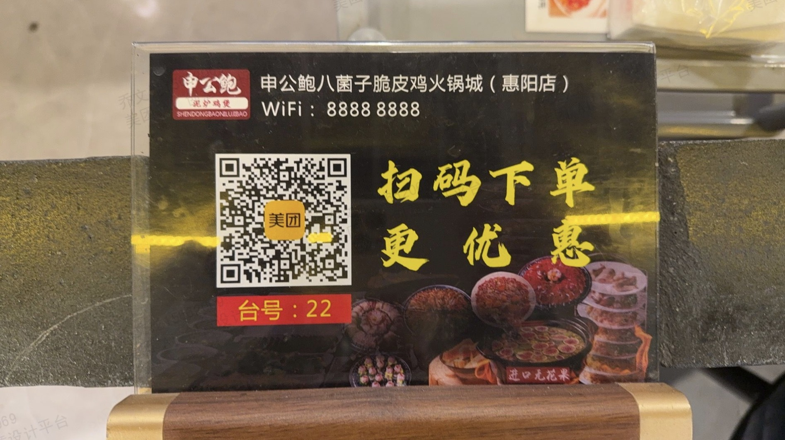

# Offline Promotion Design — Evaluation Task Set

[English](#english) | [中文](#中文)

---

## English

> **Note**: This document is the generic cross-product evaluation version. Brand-specific content has been replaced with the fictional brand 'StarSelect / 星选'. Reference images for edit-type tasks are available in `../reference-images/` and can be used directly for evaluation.

| ID | Task Type | Prompt | Reference Image |
| :--- | :--- | :--- | :--- |
| F-001 | Ambiguous[^1] | The station needs to recruit riders — make a display stand to put at the entrance | / |
| F-002 | Ambiguous[^1] | The store's 3rd anniversary needs a retractable banner stand at the entrance | / |
| F-003 | Ambiguous[^1] | Can you make the QR code payment sign for the checkout counter? | / |
| F-004 | Ambiguous[^1] | Opening next week — need to make a banner saying 'Congratulations on the Grand Opening' or similar | / |
| F-005 | Ambiguous[^1] | The shopping mall is having a food festival next month — need to make a batch of street pole flags | / |
| F-006 | Explicit[^2] | Help me design a smart ordering table card, size 20.5×14.5cm; based on the uploaded dish images, design a table card suitable for this dish |  |
| F-007 | Explicit[^2] | Based on the following event plan, create a suitable offline event promotional poster, size 60×90cm, overall style 3D C4D warm-realistic. Top title 'Dalu E-bike Rental starting from ¥10/day', subtitle 'Commute with Dalu, longer rental packages are better value'; key rental packages (card format, vertical order): 1. Flexible short rental: ¥5/3hrs; 2. 1-day rental: ¥19; 3. 3-day rental: ¥49; 4. Weekly rental: ¥109; 5. Monthly rental: ¥299. Produce three proposals | / |
| F-008 | Explicit[^2] | Design a display stand, size 60×160cm, theme is Space Journey; background should feature many claw machines; reserve space for a QR code | / |
| F-009 | Explicit[^2] | Design Spring Festival promotional hanging flags — size 30×60cm vertical hanging flag; theme: 2026 Year of the Horse Spring Festival; top: auspicious cloud pattern decorative strip; main title 'Spring Festival Special' in brush calligraphy, gold color; subtitle '¥20 off orders over ¥100' in red-background white-text explosion badge style; center: Year of the Horse zodiac paper-cut pattern decoration; colors: Chinese red as main color with gold accents; style: festive traditional, strong holiday atmosphere; printing: double-sided, waterproof material | / |
| F-010 | Explicit[^2] | Create a new store opening banner — size 600×80cm; main copy 'Warmly Celebrate the Grand Opening of XX Store' centered; subtitle 'During opening period, 20% off everything, gifts for entering'; background: bright red; font: main copy in yellow bold, subtitle in white; decoration: streaming ribbon elements at both ends; material: outdoor waterproof fabric | / |
| F-011 | Explicit[^2] | Design an annual recognition ceremony backdrop — size 800×300cm (stage backdrop); main title '2025 Annual Recognition Ceremony' centered in gold 3D lettering; subtitle 'Forge ahead together, create brilliance' below in white; background: dark blue gradient; decorative elements: symmetrical radiant lines on both sides, gold wave pattern at bottom, star light accents at four corners; bottom: reserved space for date and location; style: grand and solemn, corporate year-end gala | / |
| F-012 | Explicit[^2] | Help me design a Labor Day (May 1st) display stand (60×160cm); promotional info: spend ¥99 save ¥20, event period May 1–3; design style lively and warm | / |
| F-013 | Explicit[^2] | Create a 2026 Year of the Horse Spring Festival banner — size 300×80cm; main copy 'Warm Congratulations, Happy New Year'; color scheme: bright red background, gold text; festive traditional style | / |
| F-014 | Explicit[^2] | Design a self-pickup point retractable banner stand (60×160cm); theme: Tomorrow's Delivery, Super Savings; yellow as main color; reserve space for QR code; bottom address: 1F, Building B, No.10 Wangjing Street, Chaoyang District, Beijing | / |
| F-015 | Compound[^4] | Help me design a set of series materials for a self-pickup point: ① entrance retractable banner stand (60×160cm): featuring 'Tomorrow Delivery · Super Savings'; ② entrance banner (300×80cm): warmly welcoming customers; ③ checkout counter small sign (A5 horizontal): scan to get coupon. Three-piece set with unified visual style, main brand color yellow, clean and grand | / |
| F-016 | Compound[^4] | Design supporting materials for a tech company annual gala: ① check-in backdrop (400×200cm): theme 'Stars and Seas · 2026 Annual Gala', tech-feel blue tones; ② desk name card (20×8cm, triangular standing): matching style; ③ wayfinding sign (A4 vertical): guiding attendees to various meeting rooms. Three-piece set with unified style | / |
| F-017 | Compound[^4] | Design a set of offline promotional materials for a food delivery platform's autumn promotion event: ① 3×6 meter outdoor banner: event theme 'Autumn Carnival — Save ¥50 on Delivery'; ② 80×180cm door-type display stand: featuring brand mascot + event info; ③ A4 single-page flyer: double-sided, event poster on front, participation rules on back. Three materials with unified style | / |
| F-018 | Compound[^4] | New store opening needs a set of materials: ① store entrance opening banner (500×100cm): warmly celebrate XX store opening, 10% off everything for the first three days; ② in-store promotional display stand (60×160cm): featuring popular products and prices; ③ checkout counter card (A5 horizontal): guiding customers to follow the official account. Three materials with unified brand style, main colors yellow + white, incorporating grand opening festive atmosphere | / |
| F-019 | Compound[^4] | Design a set of rider station recruitment promotional materials: ① large display stand at station entrance (80×180cm): rider recruitment theme showing salary benefits and job advantages; ② A4 flyer: for passersby to take away, including detailed job info and QR code registration; ③ in-station bulletin board poster (60×90cm): showing rider advancement paths and incentive policies. Three materials with unified visuals conveying a positive and uplifting work environment | / |
| F-020 | Compound[^4] | Design a set of offline store materials for a food & beverage brand: ① life-size cutout sign at entrance (height 180cm): brand mascot character, right hand giving thumbs up, left hand holding a delivery meal box, happy smiling expression; ② self-pickup area floor sticker (60cm diameter circle): including brand logo and 'Self-Pickup Waiting Area' + 'Please Maintain 1 Meter Distance' prompts, design 3 different styles; ③ QR code ordering table card (15×10cm triangular standing): including QR code and recommended signature dishes. Three materials with unified style | / |

[^1]: **Ambiguous task**: the prompt is imprecise and vague, testing the model's ability to understand and creatively interpret design requirements
[^2]: **Explicit task**: the prompt is precise, including specific brand name, style, color scheme, and composition requirements; tests the model's precise execution ability
[^3]: **Edit-type task**: based on editing an existing image; tests the model's image understanding and local editing ability
[^4]: **Compound task**: requires completing a primary design task plus scene extension or multiple proposals in one conversation; tests comprehensive ability

---

## 中文

# 线下推广物料设计场景评测任务集（通用竞品版）

> **说明**：本文档为通用竞品评测版本，已移除品牌特异性内容（品牌名、IP 形象等替换为通用描述），适用于对各 AI 设计工具的横向评测。编辑型需求任务所需参考图已内置于 `images/` 目录，可直接执行评测，无需手动准备图片。

| 序号 | 题目类型 | 任务提示词 | 需要上传的图片 |
| :--- | :--- | :--- | :--- |
| F-001 | 模糊任务[^1] | 站点要招骑手，做个展架放门口 | |
| F-002 | 模糊任务[^1] | 店庆三周年需要一个易拉宝放在门口 | |
| F-003 | 模糊任务[^1] | 收银台那个扫码付款的小牌子能做吗 | |
| F-004 | 模糊任务[^1] | 下周开业要拉横幅写什么热烈庆祝之类的 | |
| F-005 | 模糊任务[^1] | 商场下个月搞美食节需要做一批道旗 | |
| F-006 | 明确任务[^2] | 帮我设计一份智能点餐台卡，尺寸 20.5x14.5cm，参考上传的菜品图片，设计成适合该菜品的点餐台卡样式 |  |
| F-007 | 明确任务[^2] | 帮我根据以下活动方案做一个合适的线下活动宣传海报，尺寸为 60\*90cm，整体风格采用三维 C4D 风格·温暖写实。顶部标题"大鹿租电动车 单日低至10元起"，副标题"上下班骑大鹿 长租套餐更优惠"；重点表达租赁套餐（卡片形式，垂直顺序排序）：1. 灵活短租：5元/3时；2. 1日租：19元；3. 3日租：49元；4. 周租：109元；5. 月租：299元。给我出三个方案 | |
| F-008 | 明确任务[^2] | 设计一款展架，尺寸 60\*160cm，主题为星空之旅，背景要有很多娃娃机，预留扫码二维码位置 | |
| F-009 | 明确任务[^2] | 设计春节促销吊旗：尺寸 30\*60cm 竖版吊旗；主题 2026 马年春节；顶部：祥云纹装饰条；主标题"新春特惠"毛笔书法字体，金色；副标题"满100减20"红底白字爆炸贴样式；中部：马年生肖剪纸图案装饰；配色：中国红为主，金色点缀；风格：喜庆传统，节日氛围浓厚；打印要求：双面印刷，防水材质 | |
| F-010 | 明确任务[^2] | 制作新店开业横幅：尺寸 600\*80cm；主文案"热烈庆祝 XX店盛大开业"居中；副文案"开业期间全场8折进店有礼"；底色：大红色；字体：主文案黄色粗体，副文案白色；装饰：两端加彩带飘扬元素；材质：户外防水布料 | |
| F-011 | 明确任务[^2] | 设计年度表彰大会背景板：尺寸 800\*300cm（舞台背景）；主标题"2025年度表彰大会"画面中央，金色立体字；副标题"砥砺前行共创辉煌"主标题下方，白色字体；背景：深蓝色渐变；装饰元素：两侧对称的光芒放射线条、底部金色波浪纹、四角星光点缀；底部：预留日期和地点信息位置；风格：大气庄重，企业年会风格 | |
| F-012 | 明确任务[^2] | 帮我设计一款五一劳动节展架（60×160cm），促销信息：消费满99减20，活动时间5月1日-5月3日，设计风格活泼温馨 | / |
| F-013 | 明确任务[^2] | 制作 2026 马年春节横幅，尺寸 300×80cm，主文案"热烈祝贺 新年快乐"，配色大红色背景、金色文字，喜庆传统风格 | |
| F-014 | 明确任务[^2] | 设计一个自提点易拉宝（60×160cm），主题：明日达超省钱，黄色主色调，预留二维码位置，底部地址：北京市朝阳区望京街道10号楼B座1层 | |
| F-015 | 复合型需求[^4] | 帮我为某自提点设计一套系列物料，包含：① 门口易拉宝（60×160cm）：主打"明日达·超省钱"；② 门口横幅（300×80cm）：热烈欢迎顾客；③ 收银台小牌子（A5横版）：扫码领优惠券。三件套视觉风格统一，主品牌色为黄色，简洁大气 | |
| F-016 | 复合型需求[^4] | 为一场科技公司年会设计配套物料：① 签到背景板（400×200cm）：主题"星辰大海·2026年度盛典"，科技感蓝色调；② 桌签名牌（20×8cm，三角立式）：统一风格；③ 水牌（A4竖版）：指引参会者到各会议室。三件套风格统一 | |
| F-017 | 复合型需求[^4] | 为某外卖平台秋季促销活动设计一套线下推广物料，包含：① 3×6米户外横幅：活动主题"秋季狂欢节，外卖立减50"；② 80×180cm 门型展架：展示品牌吉祥物形象+活动信息；③ A4单页传单：双面设计，正面活动海报，背面参与规则。三个物料风格统一 | |
| F-018 | 复合型需求[^4] | 新店开业，需要一套物料：① 店门口开业横幅（500×100cm）：热烈庆祝XX店开业，开业三天全场9折；② 店内促销展架（60×160cm）：展示爆款商品和价格；③ 收银台台卡（A5横版）：引导顾客关注公众号。要求：三件物料品牌风格统一，主色调黄色+白色，融入开业庆典氛围 | |
| F-019 | 复合型需求[^4] | 设计一套骑手站点招募宣传物料，包含：① 站点门口大展架（80×180cm）：骑手招募主题，展示薪资待遇和工作优势；② A4传单：供路人带走，包含详细岗位信息和扫码报名二维码；③ 站点内部公告栏海报（60×90cm）：展示骑手晋升通道和激励政策。三件物料视觉统一，整体传递积极正向的工作氛围 | |
| F-020 | 复合型需求[^4] | 为某餐饮品牌设计一套线下门店物料，包含：① 门口人型立牌（高度 180cm）：品牌吉祥物形象，右手竖大拇指，左手拿着外卖餐盒，表情开心微笑；② 外卖取餐区地贴（直径 60cm 圆形）：含品牌 logo 和"外卖取餐等候区""请保持1米距离"提示，设计 3 款不同样式；③ 扫码点餐台卡（15×10cm 三角立式）：含二维码和招牌菜推荐。三件物料风格统一 | |

[^1]: 模糊需求：用户的任务请求相对模糊，需要考验模型工具的理解能力
[^2]: 明确任务：用户的任务请求非常具体，对于画面各部分都有明确的要求
[^3]: 编辑型需求：图文指令编辑类型的需求
[^4]: 复合型需求：在一个需求中隐含多个任务请求
