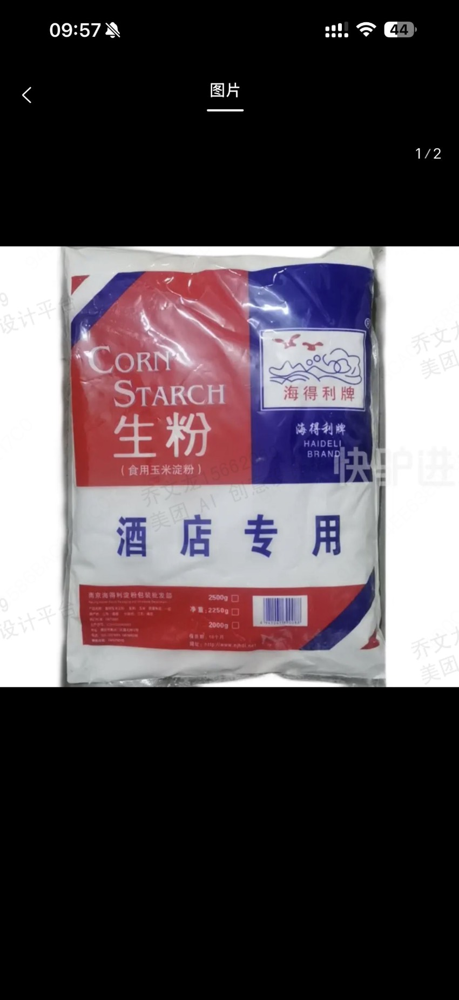
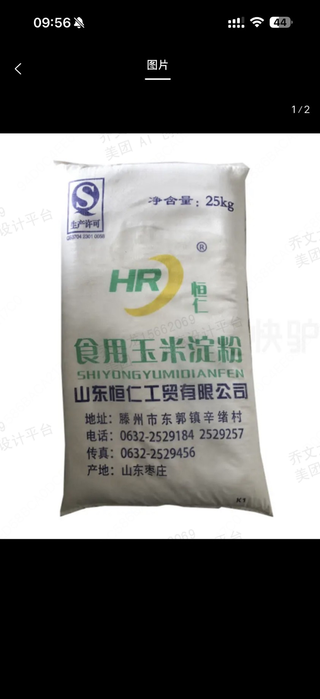
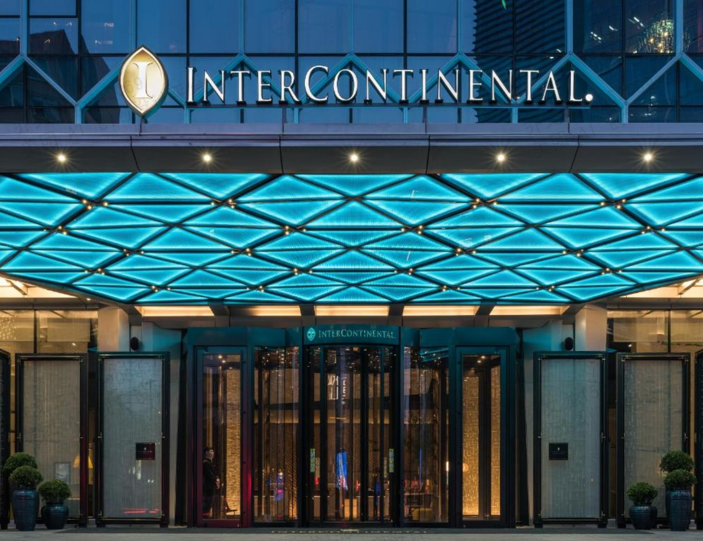
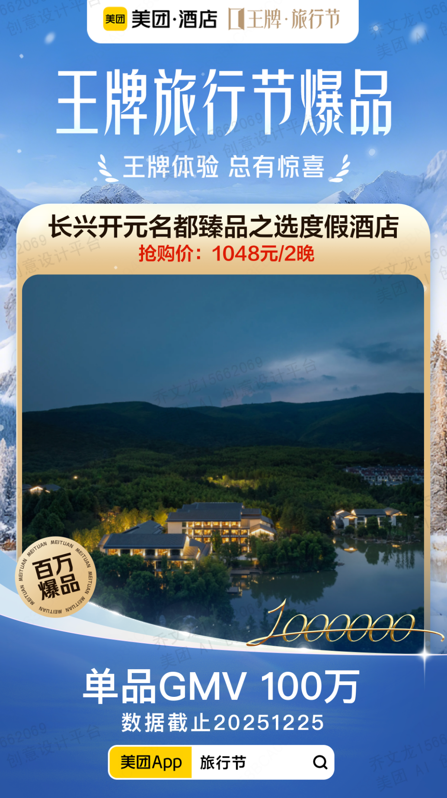
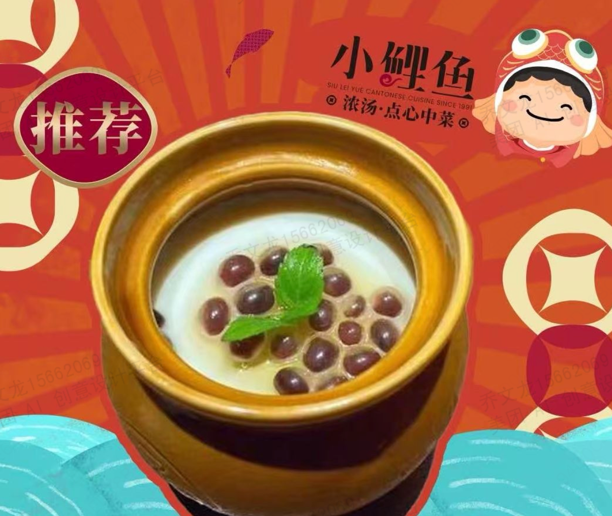
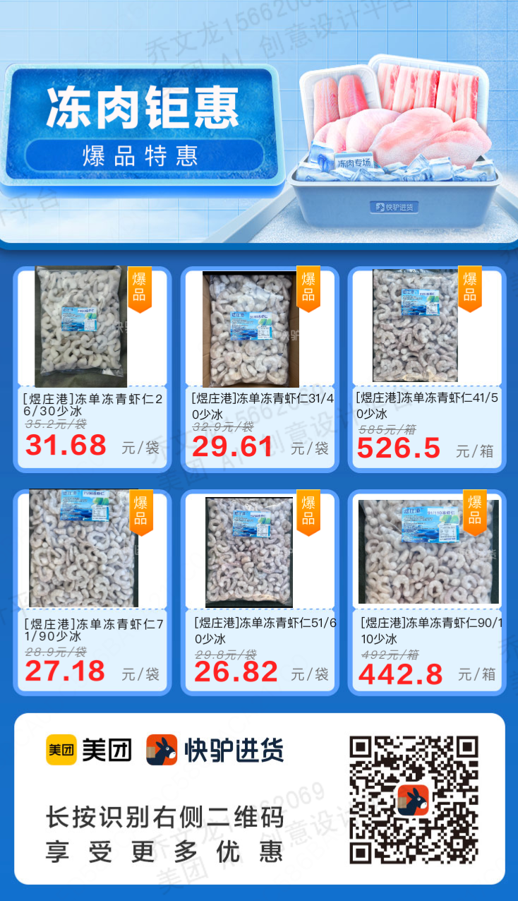

# Product Poster Design — Evaluation Task Set

[English](#english) | [中文](#中文)

---

## English

> **Note**: This document is the generic cross-product evaluation version. Brand-specific content has been replaced with the fictional brand 'StarSelect / 星选'. Reference images for edit-type tasks are available in `../reference-images/` and can be used directly for evaluation.

| ID | Task Type | Prompt | Reference Image |
| :--- | :--- | :--- | :--- |
| SP-001 | Ambiguous[^1] | Our store just launched a new taro bubble milk tea — help me make a post to share on WeChat Moments | / |
| SP-002 | Ambiguous[^1] | My boss asked me to make a group-buy image for crayfish — needs to highlight 99 yuan for 3 jin | / |
| SP-003 | Ambiguous[^1] | Help me design a set meal poster for our hotpot restaurant, the kind for 2-3 people | / |
| SP-004 | Ambiguous[^1] | Make an image of a fruit platter that looks fresh | / |
| SP-005 | Ambiguous[^1] | I opened a fried chicken shop and need a store header image | / |
| SP-006 | Ambiguous[^1] | Want to make a barbecue poster with that late-night snack vibe | / |
| SP-007 | Ambiguous[^1] | Make a special price poster for a fresh produce store's anniversary celebration — needs a festive feel | / |
| SP-008 | Explicit[^2] | Create a new bubble tea product poster — Product: one pearl milk tea, transparent plastic cup with visible black sugar pearls and tea-milk layers; Composition: product centered, 45-degree side angle; Background: gradient (light brown to milk white), clean and simple; Lighting: soft side light with highlight reflection on cup, slight reflection at bottom; Text areas: 'New Launch' label at top, product name 'Black Sugar Pearl Milk Tea' in center, '¥18' + 'Limited Time Offer' at bottom; Size: 1080×1350px vertical; Style: fresh and minimal, Instagram style | / |
| SP-009 | Explicit[^2] | Design a spicy crayfish group-buy poster — Product: a plate of bright red spicy crayfish piled in a white enamel plate; Plating: crayfish stacked with white sesame and cilantro garnish; Background: dark wood grain table with a beer glass and lemon slices; Lighting: warm top light highlighting the glossy texture of the ingredients; Text: explosion badge 'Flash Sale', product name 'Signature Spicy Crayfish 3 jin', original price ¥199, current price ¥99 in large red text, bottom 'Today Only' | / |
| SP-010 | Explicit[^2] | Design a premium fruit gift box poster — Product: high-end fruit gift box in open display state; Contents: cherries, mangoes, blueberries, kiwi elegantly arranged; Packaging: red gift box with gold ribbon; Background: pure off-white; Lighting: soft natural light with shiny water droplets on fruit surface; Copy: top 'Premium Selection Freshly Delivered', center 'Imported Premium Fruit Gift Box', price '¥298/box', selling point 'SF Express cold chain delivery' | / |
| SP-011 | Explicit[^2] | Create a hotpot set meal product poster — Main subject: bird's-eye view of yin-yang hotpot with clear red and white soup separation; Side dishes: beef rolls, beef tripe, shrimp paste, vegetable platter arranged around the pot; Text layout: top banner 'Winter Warmth Set Meal', center '2-3 Person Premium Set', price section 'Set Meal Price ¥168', details in small text 'includes pot base + 6 meat + 4 vegetable + drinks', bottom 'Dine in and enjoy immediately'; Size: 1080×1920px vertical; Style: Chinese food aesthetic, warm tones | / |
| SP-012 | Explicit[^2] | Design a cake shop store header image — Main subject: exquisite multi-layer birthday cake with cream piping decoration; Display: cake on a rotating display stand; Setting: a few small cakes and macarons beside it; Background: light pink gradient, dreamy and soft; Text: store name 'Sweet Time Bakery', tagline 'Every bite is the taste of happiness', service 'Birthday Cake custom orders' | / |
| SP-013 | Explicit[^2] | Design a Japanese sushi platter poster — Product: exquisite sushi platter with 12-16 varieties; Plating: black rectangular Japanese-style tray, neatly arranged; Types: salmon, tuna, eel, shrimp, tobiko, etc.; Background: dark gray Japanese-textured background; Text design: Japanese decorative '鮨' calligraphy character, main title 'Artisanal Sushi Platter', subtitle 'Fresh ingredients, made to order', price '¥168/serving'; Size: 1080×1080px; Style: Japanese minimalism, premium feel | / |
| SP-014 | Explicit[^2] | Design a gym promotional poster — Main visual: gym equipment area interior shot; Character: optionally add a fitness silhouette; Text: main title 'Start a Healthy Life', pricing: monthly ¥299 / quarterly ¥699 / annual ¥1999 (original ¥3600), bonus 'Includes 3 personal training sessions + 1 body assessment', bottom address + phone; Size: 1080×1920px; Style: sporty and energetic | / |
| SP-015 | Explicit[^2] | Create a car wash service group-buy poster — Main subject: car being washed with rich foam; Elements: high-pressure water gun, foam, worker silhouette; Background: blue tech-feel gradient; Text layout: main title 'Professional Car Wash, Brand New Look', service 'Exterior wash + interior vacuum + wheel cleaning', group-buy price ¥29 (original ¥58); Size: 1080×1080px; Style: professional automotive service | / |
| SP-016 | Edit-type[^3] | Please help me combine these two images into a single poster |   |
| SP-017 | Edit-type[^3] | Based on the template in image 2, use the product image in image 1 to generate a poster with the theme 'Annual Quality Product'; include the text 'Selected by platform users through voting' |   |
| SP-018 | Edit-type[^3] | Xiaoliyu Seafood Restaurant — save and check in to receive a complimentary tofu pudding with popping boba |  |
| SP-019 | Edit-type[^3] | Create a product poster: please provide me with a poster template as shown in the reference image |  |
| SP-020 | Compound[^4] | Help me create five store header images; content must include the text 'Linghui Washing & Care', style clean and simple, highlighting brand characteristics, 1:1 ratio | / |

[^1]: **Ambiguous task**: the prompt is imprecise and vague, testing the model's ability to understand and creatively interpret design requirements
[^2]: **Explicit task**: the prompt is precise, including specific brand name, style, color scheme, and composition requirements; tests the model's precise execution ability
[^3]: **Edit-type task**: based on editing an existing image; tests the model's image understanding and local editing ability
[^4]: **Compound task**: requires completing a primary design task plus scene extension or multiple proposals in one conversation; tests comprehensive ability

---

## 中文

# 商品海报设计场景评测任务集（通用竞品版）

> **说明**：本文档为通用竞品评测版本，已移除品牌特异性内容（去除平台专属品牌名称、内部数据等），适用于对各 AI 设计工具的横向评测。编辑型需求任务所需参考图已内置于 `images/` 目录，可直接执行评测，无需手动准备图片。

| 序号 | 题目类型 | 任务提示词 | 需要上传的图片 |
| :--- | :--- | :--- | :--- |
| SP-001 | 模糊任务[^1] | 我们店新出了一款芋泥啵啵奶茶，帮我做个图发朋友圈 | |
| SP-002 | 模糊任务[^1] | 老板让我做个小龙虾的团购图，要突出99块钱3斤 | |
| SP-003 | 模糊任务[^1] | 帮我设计一下我们火锅店的套餐海报，2-3人餐那种 | |
| SP-004 | 模糊任务[^1] | 做一张水果拼盘的图，要看起来新鲜 | |
| SP-005 | 模糊任务[^1] | 我开了个炸鸡店，需要一张门店头图 | |
| SP-006 | 模糊任务[^1] | 想做个烧烤的海报，夜宵那种感觉 | |
| SP-007 | 模糊任务[^1] | 生鲜店周年庆搞个特价海报，要喜庆 | |
| SP-008 | 明确任务[^2] | 制作珍珠奶茶新品海报：商品: 一杯珍珠奶茶，透明塑料杯，可见黑糖珍珠和奶茶分层；构图: 商品居中，45度侧面角度；背景: 渐变色（浅棕到奶白），简洁干净；光影: 柔和侧光，杯身有高光反射，底部有轻微倒影；文字区域: 顶部"新品上市"标签，中部品名"黑糖珍珠奶茶"，底部价格"¥18"+"限时特惠"；尺寸: 1080*1350px 竖版；风格: 清新简约，ins 风格 | |
| SP-009 | 明确任务[^2] | 设计麻辣小龙虾团购海报：商品: 一盘红亮的麻辣小龙虾，堆满白色搪瓷盘；摆盘: 小龙虾堆叠摆放，撒上白芝麻和香菜点缀；背景: 深色木纹桌面，旁边摆放啤酒杯和柠檬片；光线: 暖色调顶光，突出食材油亮质感；文字信息: 爆炸贴"限时秒杀"，商品名"招牌麻辣小龙虾 3斤装"，原价¥199，现价¥99大字红色，底部"仅限今日 \| 手慢无"；尺寸: 1080*1080px；风格: 美食摄影风，色彩饱满 | |
| SP-010 | 明确任务[^2] | 设计精品水果礼盒海报：商品: 高档水果礼盒，打开展示状态；内容物: 车厘子、芒果、蓝莓、奇异果等精致摆放；包装: 红色礼盒，金色丝带装饰；背景: 纯净米白色；光线: 柔和自然光，水果表面有光泽水珠；文案: 顶部"新鲜直达品质之选"，中部"进口精品水果礼盒"，价格"¥298/盒"，卖点"顺丰冷链 \| 坏果包赔"；尺寸: 1080*1080px；风格: 高端礼品风，简约大气 | |
| SP-011 | 明确任务[^2] | 制作火锅套餐商品海报：主体: 鸳鸯锅俯拍图，红汤白汤分明；配菜展示: 环绕火锅摆放肥牛卷、毛肚、虾滑、蔬菜拼盘；文字布局: 顶部横幅"冬季暖心套餐"，中央"2-3人精选套餐"，价格区"套餐价¥168"，包含内容小字"含锅底+6荤4素+饮料"，底部"到店即享"；尺寸: 1080*1920px 竖版；风格: 中式美食风，暖色调 | |
| SP-012 | 明确任务[^2] | 设计蛋糕店门店头图：主体: 精美多层生日蛋糕，奶油裱花装饰；展示方式: 蛋糕放在旋转展示台上；配景: 旁边摆放几款小蛋糕和马卡龙；背景: 浅粉色渐变，梦幻柔和；文字信息: 店铺名"甜蜜时光烘焙坊"，标语"每一口都是幸福的味道"，服务"生日蛋糕 \| 下午茶 \| 定制服务"；尺寸: 1080*1080px；风格: 甜美梦幻，少女心 | |
| SP-013 | 明确任务[^2] | 设计日料寿司拼盘海报：商品: 精致寿司拼盘，12-16个品种；摆盘: 黑色长方形日式餐盘，寿司整齐排列；品类: 三文鱼、金枪鱼、鳗鱼、虾、蟹子等；背景: 深灰色日式纹理背景；文字设计: 日文装饰"鮨"毛笔字，主标题"匠心寿司拼盘"，副标题"新鲜食材现点现做"，价格"¥168/份"；尺寸: 1080*1080px；风格: 日式简约，高级感 | |
| SP-014 | 明确任务[^2] | 设计健身房促销海报：主视觉: 健身房器械区环境照；人物: 可选加入健身剪影；文字信息: 主标题"开启健康生活"，价格方案: 月卡¥299/季卡¥699/年卡¥1999（原价¥3600），赠送"赠3节私教课+体测1次"，底部地址+电话；尺寸: 1080*1920px；风格: 运动活力风 | |
| SP-015 | 明确任务[^2] | 制作洗车服务团购海报：主体: 汽车正在被清洗的画面，泡沫丰富；元素: 高压水枪、泡沫、工作人员剪影；背景: 蓝色科技感渐变；文字排版: 主标题"专业洗车焕然一新"，服务内容"外观清洗+内饰吸尘+轮毂清洁"，团购价¥29（原价¥58）；尺寸: 1080*1080px；风格: 汽车服务专业风 | |
| SP-016 | 编辑型需求[^3] | 帮我把这两个图片设计成一个海报 |   |
| SP-017 | 编辑型需求[^3] | 帮我参考图2的模板，用图1的商品图生成一个海报，要求体现"年度优质商品"主题，在图中注明"由平台用户投票产生"字样 |   |
| SP-018 | 编辑型需求[^3] | 小鲤鱼海鲜酒家，收藏打卡送爆珠豆腐花 |  |
| SP-019 | 编辑型需求[^3] | 做商品海报：请给我提供一个如图所示的海报模版 |  |
| SP-020 | 复合型需求[^4] | 帮我做五张门店的头图，要求内容包含文字"玲辉洗护"，风格简明，突出品牌特色，比例 1:1 | |

[^1]: **模糊任务**：提示词不精确，方向模糊，考验模型对设计需求的理解与发挥能力
[^2]: **明确任务**：提示词精确，包含明确的商品、风格、配色、构图等要求，考验模型的精准执行能力
[^3]: **编辑型需求**：基于已有图片进行编辑修改，考验模型的图像理解与局部编辑能力
[^4]: **复合型需求**：要求在一次对话中完成多张海报设计或组合任务，考验综合能力
